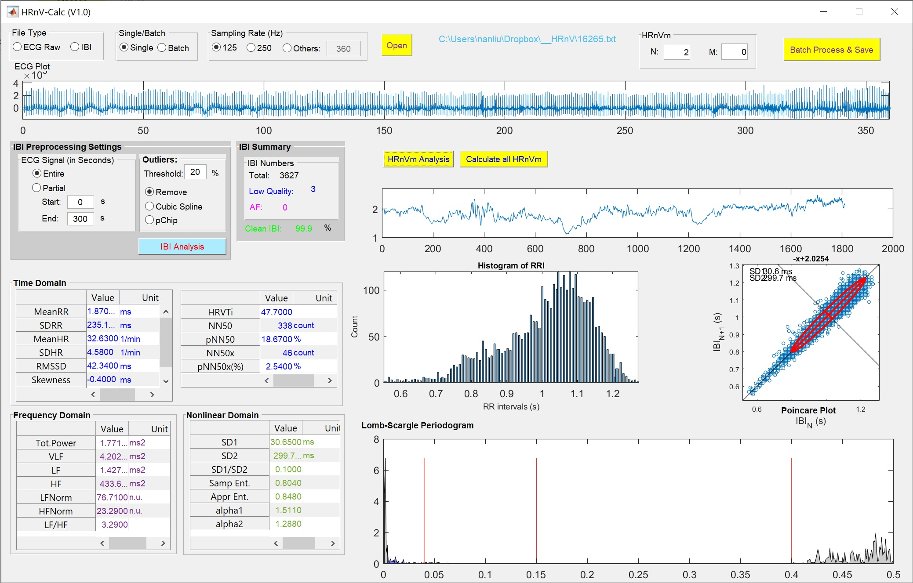

# Heart Rate n-Variability (HRnV): A Novel Representation of Beat-to-Beat Variation in ECG

\* **Correspondence: Nan Liu (liu.nan AT duke-nus.edu.sg)**

If you are conducting research on **HRnV**, please cite the following articles (Article #1 is the original methodology paper and Article #2 is the first clinical paper):
> 1) Liu N*, Guo DG, Koh ZX, Ho AFW, Ong MEH. Heart Rate n-Variability (HRnV): A Novel Representation of Beat-to-Beat Variation in Electrocardiogram. bioRxiv 2018; 449504. doi: https://doi.org/10.1101/449504

> 2) Liu N*, Guo DG, Koh ZX, Ho AFW, Xie F, Tagami T, Sakamoto JT, Pek PP, Chakraborty B, Lim SH, Tan JWC, Ong MEH. Heart rate n-variability (HRnV) with its application to risk stratification of chest pain patients in the emergency department. BMC Cardiovascular Disorders 2020; 20: 168. https://doi.org/10.1186/s12872-020-01455-8

If you are using the **HRnV-Calc** software (**HRnV-Calc** is developed based on the PhysioNet Cardiovascular Signal Toolbox), please also cite the following article:
> 3) Vest A, Da Poian G, Li Q, Liu C, Nemati S, Shah A, Clifford GD. An Open Source Benchmarked Toolbox for Cardiovascular Waveform and Interval Analysis. Physiological Measurement 39, no. 10 (2018): 105004. DOI:10.5281/zenodo.1243111; 2018.

## Introduction
We proposed a novel representation of beat-to-beat variation in electrocardiogram (ECG), named as heart rate n-variability (HRnV), as an alternative to conventional heart rate variability (HRV). The derivation of HRnV parameters are based on multiple RR interval sequences, with or without overlap. We are able to create many sets of HRnV parameters which are promising at generating supplementary information from limited data source. We believe that HRnV is an important addition to traditional HRV, and will contribute to extending the landscape of current studies on HRV.

## HRnV Applications
**Acute Coronary Syndrome**
> Liu N*, Guo DG, Koh ZX, Ho AFW, Xie F, Tagami T, Sakamoto JT, Pek PP, Chakraborty B, Lim SH, Tan JWC, Ong MEH. Heart Rate n-Variability (HRnV) and Its Application to Risk Stratification of Chest Pain Patients in the Emergency Department. bioRxiv 2019; 738989. doi: https://doi.org/10.1101/738989

## Software: HRnV-Calc
**HRnV-Calc** is a software package that calculates both HRnV and conventional HRV parameters. It is built with MATLAB and runs on the MATLAB Runtime (a FREE, standalone set of shared libraries that enables the execution of compiled MATLAB applications without installing MATLAB). The following image shows the GUI of **HRnV-Calc**.

Please do the following steps to use **HRnV-Calc** software:
1. **Download "MATLAB Runtime"** (https://www.mathworks.com/products/compiler/matlab-runtime.html), and install the software. Please download version "R2017b (9.3)".
2. **Download "HRnVCalc.rar"** and uncompress the file to obtain executable file "HRnVCalc.exe".
3. **Run "HRnVCalc.exe"** and you will see the GUI as shown above.
4. **Load ECG/IBI data by clicking button "Open"**. Make sure to choose the correct sampling rate. Parameters can be calculated for individual file (option=Single) or multiple files (option=Batch).
   - **Input as ECG**: Raw ECG waveforms.
   - **Input as IBI (We recommend this option to minimize the impact of ECG preprocessing)**: IBI is the abbreviation of interbeat interval, also sometimes referred to as R-R interval. (Note: You may consider using IBI/RRI sequences as the inputs, if you have preprocessed ECGs)
5. **Determine preprocessing settings** and run signal preprocessing by clicking button "IBI Analysis".
   - **ECG singal length**: You may choose to use "Entire" ECG/IBI to calculate HRV/HRnV parameters, or to use partial waveforms, in which you will need to define "Start" and "End" points.
   - **Outliers**: Define the threshold to remove outliers or to interpolate the values with "Cubic Spline" or "pChip". A default value of 20% is used to identify non-sinus R-R intervals as those that occur prematurely or late. Following the Physionet Cardiovascular Signal Toolbox, changes are measured in the current R-R interval from the median of previous 5 or next 5 intervals where those intervals that change by more than 20% are excluded from HRnV/HRV analysis.
   - **Clicking button "IBI Analysis"**, preprocessing will be done and results will be summarized in "IBI Summary".
6. **Calculate HRnV or HRV parameters**.
   - **Key in "n" and "m" values at top right corner of the GUI**. For example, HR3V parameters are calculated when N=3 and M=0; HR3V1 parameters are calculated when N=3 and M=1; and conventional HRV parameters are calculated when N=1 and M=0.
   - **Click button "HRnVm Analysis" to start calculation**. After clicking, a window will pop-out to show the file used to store the parameters. By default, the name of the file is "OriginalFileName_HRnVm.xls".
   - **Click button "Calculate all HRnVm" to calculate all parameters at one time**. For example, when N=3, this function will gives you parameters of HRV, HR2V, HR2V1, HR3V, HR3V1, and HR3V2.
